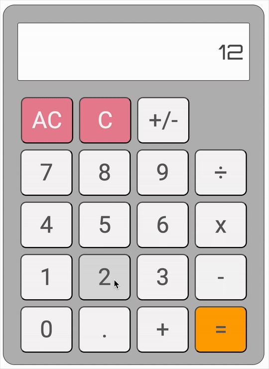

# 🧮 Calculator — The Odin Project Foundation Capstone

This project is the capstone for **The Odin Project Foundation** module.  
It’s a simple calculator built entirely from **HTML**, **CSS**, and **JavaScript** — no libraries, no frameworks.

---

## 🚀 Features
- **UI built with Flexbox** — arranging the buttons and display was fun and helped solidify my layout skills.
- **State management for operands and operators** — handles multiple operations in sequence (chained calculations) without needing to clear between each one.
- **Smart number formatting** — large, small, and long decimal numbers are displayed neatly using `toExponential()` and `toPrecision()`.

---

## 🎯 Challenges
- Managing state so the calculator works correctly for chained operations.
- Preventing display overflow while keeping results accurate and readable.
- Handling a mix of integers, decimals, and scientific notation without breaking the UI.

---

## 💻 How to Use
1. **Click the on-screen buttons** to enter numbers and operators.
2. Perform a calculation:
   - Example: `12 × 3 = 36`
3. Continue calculations without clearing — results are carried forward automatically.
4. Use the **AC** button to reset the calculator.

---

## 📚 Reflection
This was a challenging but rewarding project that pulled together everything I’ve learned in this module — from **JavaScript logic** to **CSS layout** and **DOM manipulation**.  
It was a great test of my ability to manage state, format output dynamically, and make the UI responsive and user-friendly.

